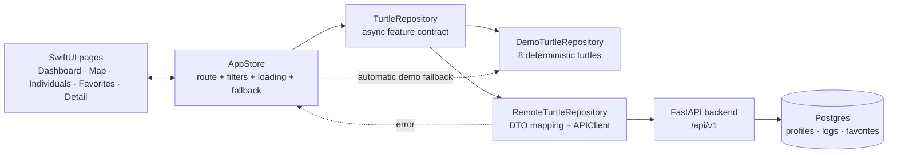

# Ada Penyu Desktop architecture

The desktop app is a native SwiftUI client with one state owner and a replaceable data boundary. The default repository is deterministic demo data; the live repository calls the FastAPI backend without coupling screens to HTTP or database details.

## Runtime architecture



## Responsibilities

| Layer | Files | Responsibility |
| --- | --- | --- |
| Shell | `ContentView.swift`, `Components/AppShellComponents.swift` | Navigation, top bar, mode switch, contextual export, global error/loading surfaces. |
| State | `AppStore.swift` | Owns route, query state, selected turtle, async loading, optimistic favorites, fallback status, and export command. |
| Contract | `DataLayer.swift` | Shared query/value types, `TurtleRepository`, API DTOs, date/status mapping, and repository implementations. |
| Feature views | `Views/DashboardView.swift`, `MapCanvasView.swift`, `CollectionViews.swift`, `TurtleDetailView.swift` | Render realistic data and emit user intent through bindings/closures. No view performs HTTP. |
| Domain/design | `AppModel.swift`, `DesignSystem.swift`, `Components/` | Stable display models, colors, spacing, condition semantics, branding, and reusable controls. |
| Backend | `app/api/`, `app/services/`, `scripts/seed_desktop_demo.py` | REST endpoints, persistence, and reproducible demo records. |

## User flow

```text
Launch
  → AppStore.bootstrap()
  → parallel individuals + favorites + dashboard + map requests
  → dashboard is immediately usable

Individuals
  → search/species/condition/sort
  → repository query with pagination
  → select row
  → detail loads measurements, locations, and sighting log

Map
  → period/species/condition filters
  → focus a pin or result card
  → explicit “Open turtle detail” action

Any API failure in Live mode
  → preserve the user's context
  → switch to deterministic Demo mode
  → show a non-blocking fallback notice
```

## API contract used by the desktop client

| Capability | Endpoint |
| --- | --- |
| Individuals | `GET /api/v1/individuals` |
| Favorites | `GET/PUT/DELETE /api/v1/favorites` |
| Dashboard | `GET /api/v1/dashboard/summary` |
| Map sightings | `GET /api/v1/dashboard/map/sightings` |
| Turtle detail | `GET /api/v1/individuals/{id}/logs` |
| Export | `GET /api/v1/exports/individuals` |

All requests are made through `APIClient`, which centralizes base URL, user identity, ISO-8601 decoding, and HTTP error handling. `RemoteTurtleRepository` translates backend DTOs into the view-facing models, so page code stays independent of response shape.

## Why this shape

- A single store prevents favorites, counts, search, and detail navigation from drifting between screens.
- A repository boundary makes Demo mode reliable for tomorrow's demo while keeping Live API one menu action away.
- Parallel bootstrap reduces the perceived wait for a cold API.
- Empty, loading, and fallback states are explicit, so a slow or sparse backend never renders a misleading blank panel.
- Map filters are scoped to the map and no longer leak the Individuals page's filters.
